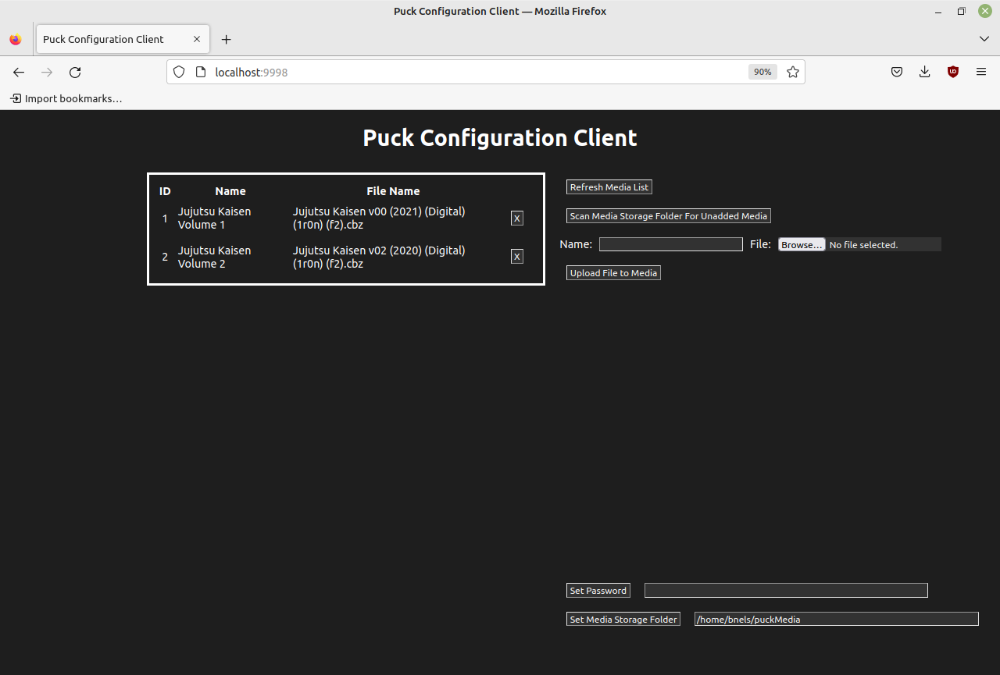
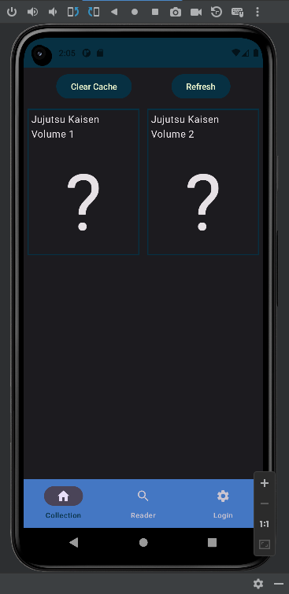
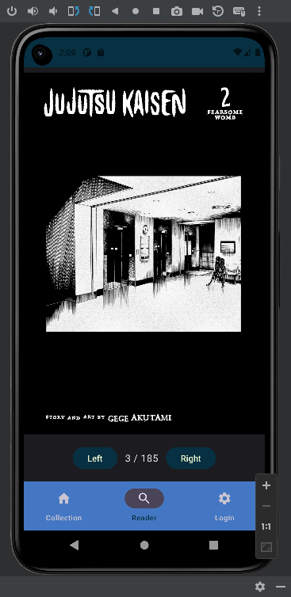

<h1 align="center">puck</h1>  
<p align="center">  
 <b>Lightweight, user-friendly Android application and media server for reading and organizing your comics/manga. </b>  
</p>

<hr>

<h3>Dependencies</h3>

<ul>
    <li>Node.js</li>
    <li>Yarn package manager</li>
    <li>TypeScript</li>
</ul>

<hr>

<h3>Build and run the server</h3>

```
cd server
python build.py
node build/src/app.js
```

<hr>

<h3>Screenshots</h3>

<p>Configuration Client</p>



<p>Android Reader</p>




